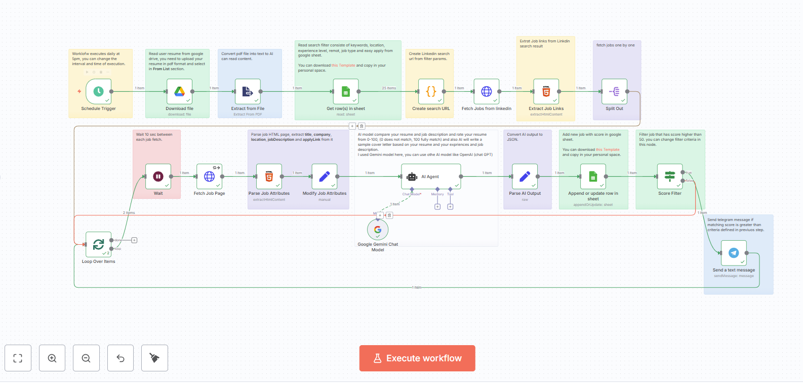

# 🤖 LinkedIn Job Hunter AI

> Automated Job Search Assistant with AI-Powered Resume Matching & Telegram Notifications

[](https://linkedin.com)
[](https://telegram.org)
[](https://n8n.io)

An intelligent agent that automatically:
-  Matches your resume with LinkedIn job posts
-  Generates personalized cover letters
-  Provides job matching scores
-  Sends real-time alerts via Telegram


##  Workflow Overview



---

## ✨ Features
- Automatically generates a LinkedIn job search URL based on criteria.  
- Fetches job postings (title, company, location, link, description).  
- Scoring system to filter relevant job offers.  
- Sends a **Telegram** notification with a direct link to the posting.  

---

## 🛠️ Installation

1. **Clone the project**
   ```bash
   git clone https://github.com/yourusername/job-search-bot.git
   cd job-search-bot
   ```

2. **Install dependencies**
   ```bash
   npm install
   ```

3. **Configure environment variables**  
   Copy the example file:
   ```bash
   cp .env.example .env
   ```
   Then fill in `.env` with your credentials:  

   ```
   TELEGRAM_BOT_TOKEN=xxxxxx:yyyyyyyyyyyy
   TELEGRAM_CHAT_ID=123456789
   ```

   ⚠️ **Never push `.env` to GitHub** → keep it secret.  

---


## 📂 Project Structure

```
/job-search-bot
  /src
    createSearchURL.js      # Generates LinkedIn search URL
    fetchLinkedIn.js        # Fetches job postings
    scoring.js              # Calculates relevance score
    telegramSender.js       # Sends Telegram messages
    index.js                # Workflow orchestration
  /workflows
    job-search-workflow.json # Exported n8n/Make workflow
  .env.example
  .gitignore
  README.md
```
